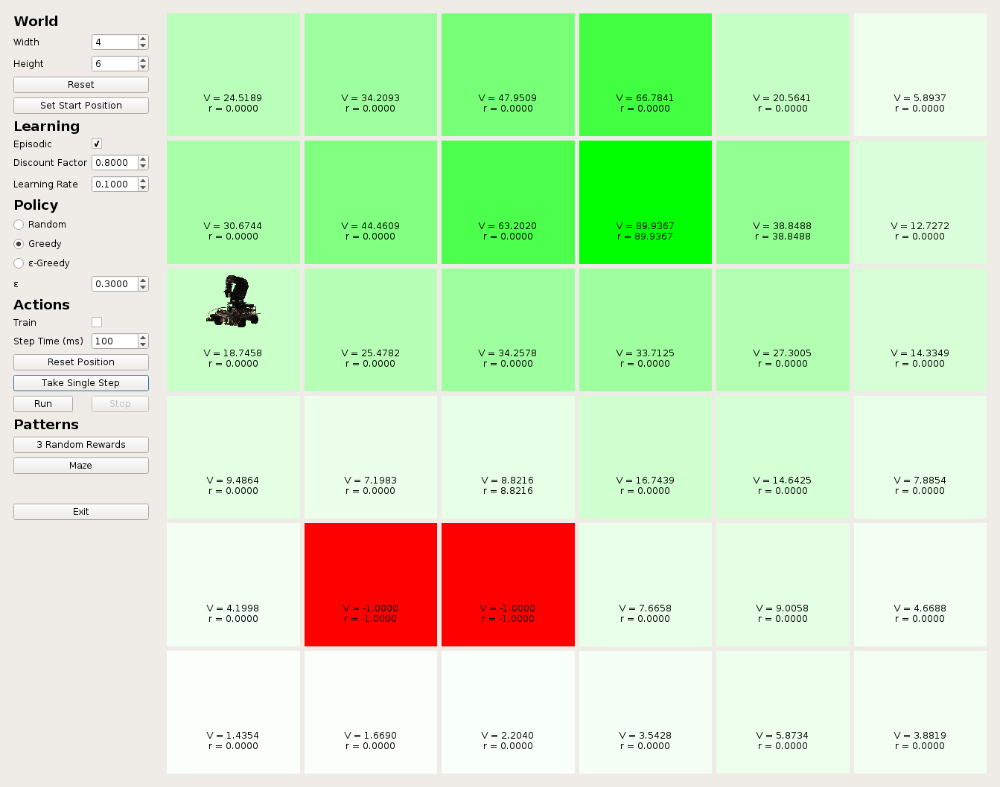

# RL-GridWorld
Graphical gridworld sandbox for reinforcement learning. Uses Q-learning to learn utility function and greedy policy w.r.t. learned utility. The GUI is implemented using PyQt5.

Run with:
```
python3 main.py
```

## Features
* Dynamic world size
* Customizable learning rate, discount factor, rewards
* Support for episodic and non-episodic settings
* Different policies
  * Random
  * Greedy w.r.t. learned utility
  * &#949;-Greedy

## Screenshot


## Dependencies
* PyQt5
* NumPy
